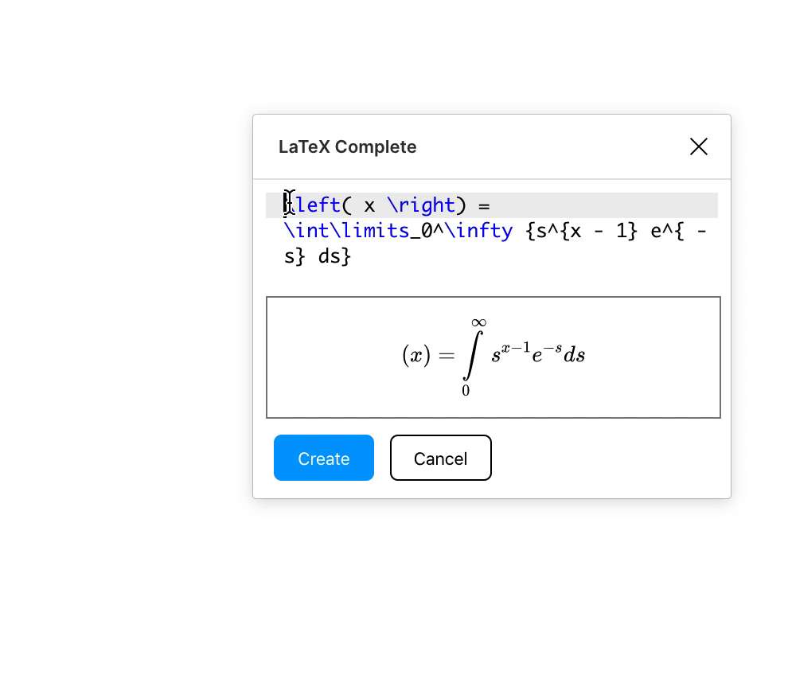

# LaTeX Complete

## Developing

After running your first build (below), add the plugin to your Figma desktop client. Open the `Resources` panel (shift-I), then click `Plugins`, select `Development`, click `+`, `Import plugin from manifest`, then select `manifest.json` in this repo.

### Dev build

`npm run build:watch`

### Prod build

**Note: prod build is much faster to load when testing stuff**

`npm run build`

`symbols.json` mapped from https://github.com/vspinu/math-symbol-lists/blob/master/math-symbol-lists.el via https://repl.it/@MaxKrieger/PuzzlingAppropriateMuse

## Roadmap

-   [ ] Adjustable size
-   [ ] Reduce package size via webpack magic

## Related work

https://www.figma.com/c/plugin/754622689958838972 (seems to be broken as of 01/06/2020)

https://github.com/zindlerb/tex-block
